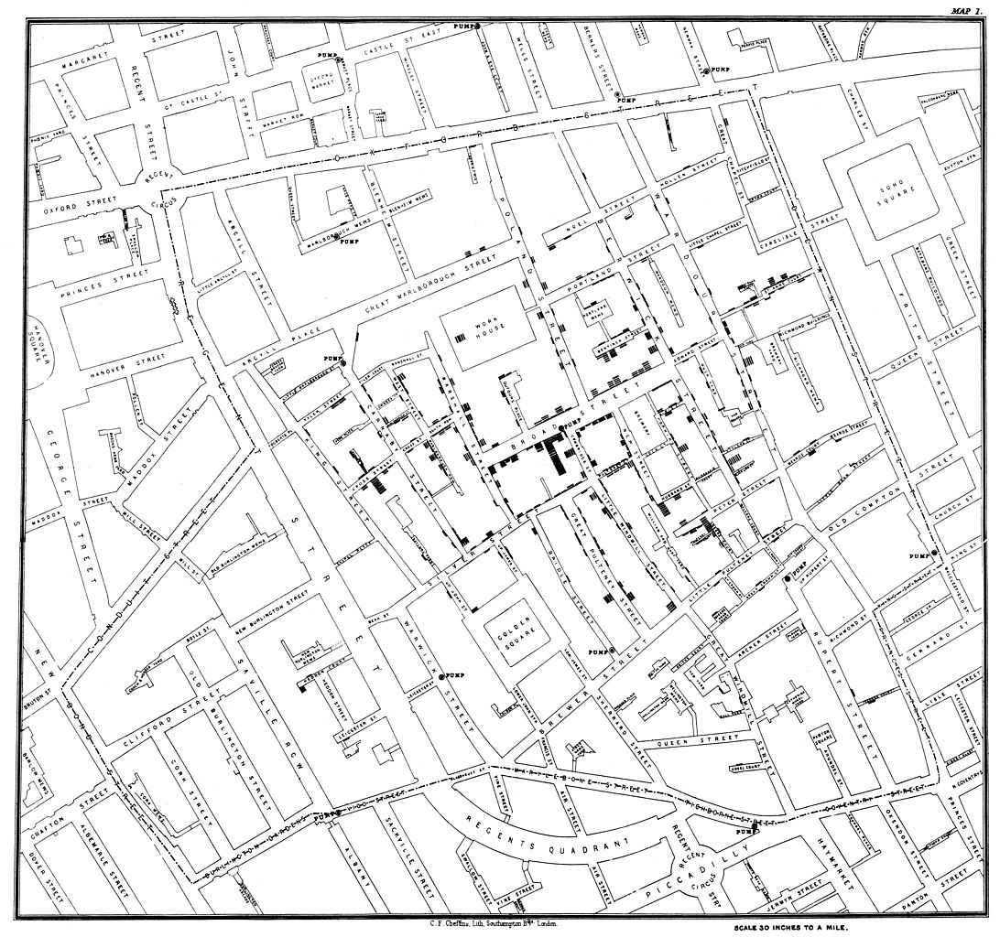

{{< interactive-figure frequencyDistributionCover makeFrequencyDistributionCover options='{"aspectRatio":"2:1"}' fallback="The same scores animating through a bar graph, a histogram, a frequency polygon, and a smooth frequency curve." >}}

In this chapter, we'll introduce our first actual statistic, *frequency*, and we'll explore how it can be reported in tables and visualized using bar graphs, histograms, frequency polygons, and smooth curves.

## What is frequency?

Suppose you have a stack of 100 paper surveys that people have filled out. Each one asked the same question: "In general, how do you feel about the current President of the United States?" The people answering had three options to choose from: "approve," "disapprove," or "no opinion." How might you begin to organize and summarize your findings?

One thing you might do is take the whole stack and sort the surveys into three piles, one for each response. If you got down to eye-level with the desk and looked at the three resulting stacks from the side, you would have a perfectly serviceable visual representation of the frequency of each response, meaning simply how frequently each occurred. The taller the pile, the more people picked that response. In @fig-surveys, you can clearly see that more people picked "approve" than either of the other options by quite a wide margin.

::: {#fig-surveys}


A representation of 100 surveys stacked up on a desk, sorted by response to the question "In general, how do you feel about the current President of the United States?"
:::

If you wanted to be a bit more precise, you could count how many surveys are in each pile and record the numbers in a table. You could also calculate the percentage of the total responses that each category represents. @tbl-approval shows the results of a real survey like this. It was carried out by the Gallup polling organization in 1945 during the presidency of Harry S. Truman. More than 3,000 people were asked "Do you approve or disapprove of the way Truman is handling his job as President?" Notice the specificity: it didn't ask people to give a detailed narrative of their every opinion of Truman, just to choose from "approve" or "disapprove," or "no opinion" if they couldn't pick one of those. The table of results shows the number of people who picked each response, as well as the percentage of the total valid responses that each category represents. (The full sample consisted of 3,096 people. The numbers in the table add up to slightly less than that, though, because valid responses to that question weren't recorded for everyone who took the survey. It can be surprisingly hard to get a lot of people to answer a question.)

| Opinion | $f$ | Percent |
|:--------|----:|--------:|
| Approve | 2,465 | 81% |
| Disapprove | 258 | 8% |
| No opinion | 323 | 11% |

: President Harry S. Truman's approval ratings from a survey of 3,096 adults conducted Oct 5--Oct 10, 1945. Source: [Gallup/Roper](https://ropercenter.cornell.edu/ipoll/study/31087340). {#tbl-approval}

Once we've calculated an approval percentage for one survey, we can put the results of many surveys together to see how approval ratings have changed over time. @fig-presidential-approval is a time series: it plots the percentage of "approve" responses across all completed presidential terms from Truman through Biden.

::: {#fig-presidential-approval}

{{< interactive-figure presidentialApproval makePresidentialApprovalChart options='{"excludeTerms":[{"president":"Franklin D. Roosevelt","term":"1st term"},{"president":"Donald J. Trump","term":"2nd term"}],"xStartYear":1944,"xEndYear":2025}' fallback="Line chart of presidential job approval across completed terms from Truman through Biden." >}}

Presidential job approval ratings across all completed presidential terms from Truman through Biden. Data from the [American Presidency Project](https://www.presidency.ucsb.edu/statistics/data/presidential-job-approval-all-data).

:::

Do you notice any trends? You might look for differences between presidents. Some --- Truman, both Bushes --- had a very big difference between their highest and lowest approval ratings, while others stayed within a narrower range. Or you might look for common themes across all the presidents. In most cases, presidents seem to end up with lower approval ratings than they started with. And that helps us to put the results of a single survey into context. The data in @tbl-approval came from early in Truman's presidency; the numbers would have looked different if we instead examined a survey conducted later in his term.

### Why frequency?

Let's take a step back for a moment and think about why frequency is such a fundamental concept in statistics. What are we trying to do?

Formally, statistics (like frequency) are mathematical procedures used to collect, organize, summarize, and interpret information. They allow for standardized evaluation and comparison, which can help uncover meaningful patterns in data.

Slightly more informally:

> Statistics are a bunch of numbers looking for an argument.^[This appears in the book *3,500 Good Quotes for Speakers*, unattributed.]

That quip bluntly highlights what more formal definitions dress up in more clinical terms. Statistics are produced and reported for a purpose. Data don't interpret themselves, no matter what statistical procedures we subject them to. Ultimately, *we* have to form the argument about what the numbers mean. Even making something as seemingly simple and objective as a frequency table or graph is an intentional act, and we should consider the purpose behind it.

With the polling data, the purpose is to see the overall trend: is the president popular or not? By forcing respondents to simply sort themselves into one of the applicable boxes, the question is largely blind to the myriad reasons *why* any given individual answered the way they did, all the idiosyncratic enthusiasms and grievances that contributed to someone ticking the approve or disapprove box. That can be a good thing: sometimes we need to see the big picture first, and it can guide us toward the issues we want to drill into later. But "what is the trend?" is a different question from "why this trend?" We need to keep in mind what questions a summary can answer and what questions it cannot. Why was that question chosen, and not another?

## Frequency tables

Now that we've seen frequency in action, let's work through building a frequency table from scratch.

In general, a frequency table organizes and displays data and conveys how observations are distributed. It shows at least two things: the values, categories, or bins that make up the variable, and the frequency --- by which we just mean the number of observations --- that falls into each one. It may also contain some additional information, such as proportions, percentages, or cumulative frequencies.

Exactly what goes in the first column depends on the kind of variable we're dealing with. For a categorical variable, each row represents a recorded category. If the variable is nominal, there's no inherent order to the categories, and so we can arrange them in whatever order is most useful. That could be alphabetical, in the order that categories were first observed, or in ascending or descending order of frequency. If the variable is ordinal, the rows have a meaningful order and would be arranged either lowest to highest or highest to lowest.

For a discrete quantitative variable with only a few possible values, each row can represent one value. (Things become slightly more complicated for continuous variables or quantitative variables with a lot of possible values, so we'll come back to them in the next section.)

Let's put together a simple table step by step. For this example, imagine we've asked fifteen people how many languages are regularly spoken in their household. So the resulting numbers reflect observations of this discrete quantitative variable.

::::: {.callout-tip .interactive}
## Build a frequency table

{{< interactive-figure frequencyTableTutorial makeFrequencyTableTutorial options='{"data":[2,1,2,3,4,3,3,2,2,1,5,3,4,1,2],"variable":"Languages","dataLabel":"Languages spoken at home","ariaLabel":"Frequency table under construction for the number of languages spoken at home"}' fallback="Step-by-step tutorial building a frequency table from 15 responses about the number of languages regularly spoken at home." >}}

:::: {.callout-footer}
::: {.tutorial-step data-title="Raw data" data-major="start" data-major-title="Start" data-action='{"table":false,"columns":[],"rows":[],"frequencies":[],"highlight":null,"animate":false}'}
Here are the raw data. The observed values run from 1 through 5. Even with a relatively small toy dataset, it is hard to make much sense of the numbers without a bit of organization and summarization.
:::

::: {.tutorial-step data-title="Two columns" data-major="structure" data-major-title="Structure" data-action='{"table":true,"columns":["label","frequency"],"rows":[],"frequencies":[],"highlight":null,"animate":true}'}
To start constructing our table, we will make a header row and two columns. The first column will contain the recorded values. Here we'll label it __Languages__, since that's what those numbers represent. The second will contain the frequencies: the number of times each value was observed. We'll label it $f$. (You will sometimes see $n$ or $N$ used instead of $f$. But since we'll be using those symbols elsewhere to indicate the total number of observations in a sample or population, we'll stick with $f$ for frequency so as not to confuse each individual row's count with the fixed total.)
:::

::: {.tutorial-step data-title="List the values" data-major="structure" data-major-title="Structure" data-action='{"table":true,"columns":["label","frequency"],"rows":"all","frequencies":[],"highlight":null,"animate":true}'}
To fill in the table, the first job is to list the values from low to high (though high to low would also work). The lowest possible response was 1 (you can't have zero languages). There's theoretically no maximum number of languages that could be spoken, but the highest answer we got was 5, so we can stop there.
:::

::: {.tutorial-step data-title="Count the 1s" data-major="count" data-major-title="Count" data-action='{"table":true,"columns":["label","frequency"],"rows":"all","frequencies":[1],"highlight":1,"animate":true}'}
Now we start counting. Three participants reported 1 language, so the row for 1 has a frequency of 3.
:::

::: {.tutorial-step data-title="Count the 2s" data-major="count" data-major-title="Count" data-action='{"table":true,"columns":["label","frequency"],"rows":"all","frequencies":[1,2],"highlight":2,"animate":true}'}
Next, count the 2s. Five participants reported 2 languages, so record a frequency of 5 in the row for 2.
:::

::: {.tutorial-step data-title="Count the 3s" data-major="count" data-major-title="Count" data-action='{"table":true,"columns":["label","frequency"],"rows":"all","frequencies":[1,2,3],"highlight":3,"animate":true}'}
Four participants reported 3 languages. Add 4 to its frequency row.
:::

::: {.tutorial-step data-title="Count the 4s" data-major="count" data-major-title="Count" data-action='{"table":true,"columns":["label","frequency"],"rows":"all","frequencies":[1,2,3,4],"highlight":4,"animate":true}'}
Two participants reported 4 languages. Add 2 to its frequency row.
:::

::: {.tutorial-step data-title="Count the 5s" data-major="count" data-major-title="Count" data-action='{"table":true,"columns":["label","frequency"],"rows":"all","frequencies":"all","highlight":5,"animate":true}'}
Finally, just one participant reported 5 languages. Add 1 to its row, and the basic frequency table is complete.
:::

::: {.tutorial-step data-title="Read the pattern" data-major="interpret" data-major-title="Interpret" data-action='{"table":true,"columns":["label","frequency"],"rows":"all","frequencies":"all","highlight":null,"animate":true}'}
Now the pattern is easier to see: most participants reported 2 or 3 languages, while only one reported 5. By organizing the responses and counting their frequencies, we turn the raw data into something we can begin to understand in general terms.
:::

::: {.tutorial-step data-title="Additional columns" data-major="extend" data-major-title="Extend" data-action='{"table":true,"columns":["label","frequency","proportion","percent","cumulativeFrequency","cumulativePercent"],"rows":"all","frequencies":"all","highlight":null,"order":"ascending","animate":true}'}
Several optional columns can make the table more informative. Proportion is frequency divided by the total number of responses, $p = f/N$, and percentage is $p \times 100$. Cumulative $f$ is the running count as you move down the rows, while cumulative percentage is the running percentage. Because this table runs from low to high, the cumulative columns tell us how many responses are *at or below* each value. The last row reaches a cumulative $f$ of 15 and 100%, accounting for all the responses.
:::

::: {.tutorial-step data-title="High to low" data-major="order" data-major-title="Order" data-action='{"table":true,"columns":["label","frequency","proportion","percent","cumulativeFrequency","cumulativePercent"],"rows":"all","frequencies":"all","highlight":null,"order":"descending","animate":true}'}
We could instead sort the values from high to low. The frequencies and proportions do not change, but the cumulative columns now build downward from the highest value, so they tell us how many responses are *at or above* each value. Descending order can foreground larger values or values above a threshold; ascending order can foreground smaller values or values below a threshold. Which is more useful depends on what we want to know about the data.
:::
::::

:::::

One thing to note: the possible values of a variable may not all appear in the data, but we might include them in our table with a frequency of zero. Suppose the data in the exercise above had not included anybody who said 3 languages. We would still include a row for 3 with a frequency of 0. With a quantitative variable, including unobserved values within the range we display keeps gaps in the data visible. Or suppose the same data had represented the number of siblings each participant has rather than number of languages spoken at home. Then the possible scores would start at 0. Even if there were no responses of 0 in the data, it could still be useful to include a row for it with a frequency of 0, making that absence explicit. Whether we extend the table beyond the observed scores to cover the variable's entire possible range depends on what is useful. That can make sense when the possible range is known and manageable, but less sense when the range is very large or has no fixed upper limit. (We stopped the table above at 5, the highest observed value, because there is no theoretical limit to the number of languages a household could speak.) With a nominal variable, we might include only categories that actually occurred, or include an empty category if its absence is itself noteworthy. As always, choices, choices.



## Grouped frequency tables {#sec-grouped-frequency}

The table we just made is fairly compact because our toy sample contains only five distinct values, all clustered within a short span. But when a quantitative variable has many possible values across a wider range, an ungrouped table can become unwieldy.

Take these scores from a 20-question multiple-choice test taken by 40 students. Each score is a whole-number count of how many questions a student answered correctly.

::: {style="text-align: center; font-size: 1.1em;"}
3&emsp;5&emsp;6&emsp;7&emsp;10&emsp;12&emsp;13&emsp;13\
14&emsp;14&emsp;14&emsp;15&emsp;15&emsp;15&emsp;16&emsp;16\
17&emsp;17&emsp;17&emsp;17&emsp;17&emsp;18&emsp;18&emsp;18\
18&emsp;18&emsp;19&emsp;19&emsp;19&emsp;19&emsp;20&emsp;20\
20&emsp;20&emsp;20&emsp;20&emsp;20&emsp;20&emsp;20&emsp;20
:::

An ungrouped frequency table covering the observed range from 3 through 20 would need 18 rows. If we included every possible test score from 0 through 20, it would need 21. And quite a few of those rows would have a frequency of zero or one. Here are the first few:

| Test score | $f$ |
|:-----------|----:|
| 0 | 0 |
| 1 | 0 |
| 2 | 0 |
| 3 | 1 |
| 4 | 0 |
| 5 | 1 |
| 6 | 1 |
| 7 | 1 |
| &#8942; | &#8942; |

: The first eight rows of an ungrouped frequency table for the test scores. Several possible scores at the low end did not occur at all, and the others occurred only once. {#tbl-ungrouped-test-scores}

This tells us exactly what happened at each possible score, but it doesn't give us a very compact summary. A solution is to create a **grouped frequency table**. Instead of giving every possible score its own row, we divide the scale into **bins** and count how many observations fall into each one. (Bins are also sometimes called *class intervals* or *categories*, but I think *bin* is the most useful term here: it avoids confusion with the idea of categorical data, and statistical software commonly uses *bin* and *bin width* in this context.)

So how should we construct the bins? There is no single mathematically required answer, but there are some helpful rules of thumb:

1. Choose enough bins, given the range of the data, to reveal the shape of the distribution without simply recreating the raw list. Around ten bins is often a good starting point, but that isn't written in stone. In some cases more or fewer than ten may be better.
2. Use bins of equal width. Bin widths such as 2, 5, or 10 can be easy to read, but 3 or 7 or whatever can be perfectly valid depending on the data and the purpose.
3. Choose a lower limit at or below the lowest observed value. A multiple of the bin width is often tidy, but that's more an aesthetic preference than a mathematical necessity.
4. Make the bins cover the range you want to show without gaps or overlaps, so that every observation belongs to exactly one bin. If the variable has a meaningful, manageable range of possible values, it can be useful to include all of them, even those that did not occur.
5. Have fun and be yourself. By which I mean, ignore the rules if you think doing so makes for a more effective summary. You can find examples in the very next chapter which go against the advice about starting on a multiple of the bin width (@fig-tone-scramble-performance) and about keeping all bins equal width (@fig-income-distribution). The most important thing is to make choices that suit your data and your purpose.

With those rules of thumb in mind, @tbl-grouped-test-scores shows one way of grouping those test scores. I chose a bin width of 3, because it divides the full range of possible scores (0 through 20) neatly into seven equal bins. That's a little fewer than our rule-of-thumb target of around ten, and the resulting bin width of 3 is less pleasing than, say, 2 or 5, but it includes every possible score. Rules of thumb are there to help us make a useful summary, not to make the choice for us.

| Test score | $f$ | % | Cumulative % |
|:-----------|----:|--:|-------------:|
| 0--2 | 0 | 0.0 | 0.0 |
| 3--5 | 2 | 5.0 | 5.0 |
| 6--8 | 2 | 5.0 | 10.0 |
| 9--11 | 1 | 2.5 | 12.5 |
| 12--14 | 6 | 15.0 | 27.5 |
| 15--17 | 10 | 25.0 | 52.5 |
| 18--20 | 19 | 47.5 | 100.0 |

: A grouped frequency table for the 20-question test scores, using bins three points wide. {#tbl-grouped-test-scores}

Now the broader pattern is easier to see: scores are bunched toward the top of the scale, while low scores are rare. But we lose resolution. The table tells us that nineteen people scored somewhere from 18 through 20, but not how many got each score. We have chosen to sacrifice some detail in order to make the general pattern more visible. Different choices could make that pattern more or less clear; there are no mechanical rules to follow. The best we can do is make informed and reasonable choices.

### Continuous variables

Grouping is also generally necessary with continuous data. The exact recorded values depend on the precision of our measurement. With enough precision, no two observations might be exactly alike, in which case an ungrouped frequency table would barely be a summary at all.

For example, here are fifteen observations with much the same broad pattern as the data we used to construct that simple table a moment ago. But rather than being discrete, this time let's suppose the values reflect a continuous variable. Perhaps they are times, recorded on a stopwatch to the nearest tenth of a second.

::: {style="text-align: center; font-size: 1.1em;"}
2.3&emsp;0.8&emsp;1.9&emsp;3.4&emsp;3.7&emsp;2.6&emsp;3.1&emsp;2.2\
1.6&emsp;1.4&emsp;4.8&emsp;2.5&emsp;4.3&emsp;0.7&emsp;2.0
:::

We could build a frequency table for these scores by giving each recorded value its own row, but no two observations are the same at this level of precision, so all the frequencies would be 1. We'd also have a lot of zero-frequency rows if we include a row for each decimal along the range of the data: listing every 0.1 increment between the lowest (0.7) and highest (4.8) values would take 42 rows. That would not be much of a summary.

So we'll group these scores too. One reasonable approach would be to round to the nearest whole number. What that means, specifically, is to define the boundaries of each bin with **cut points**: one bin covers 0.5 to 1.5, the next 1.5 to 2.5, then 2.5 to 3.5, and so on up to 5.5. This gives a bin width of 1.0. But let's be careful: notice that we recorded a score of 2.5. Which bin does it go into, 1.5--2.5 or 2.5--3.5? There is no mathematical law that says what we have to do. One common convention, and the one we'll use here, is for a bin to include its lower cut point and exclude its upper one. So the 1.5--2.5 bin holds everything from 1.5 up to *but not including* 2.5. The score of 2.5 goes into the next bin, 2.5--3.5. (This matches the familiar convention of rounding a value ending in .5 up to the next whole number.)

The resulting grouped frequency table is shown in @tbl-grouped-continuous.

| Score bin | $f$ |
|:----------|----:|
| 0.5--1.5 | 3 |
| 1.5--2.5 | 5 |
| 2.5--3.5 | 4 |
| 3.5--4.5 | 2 |
| 4.5--5.5 | 1 |

: A grouped frequency table for the continuous scores, using bins one unit wide. {#tbl-grouped-continuous}

Now we have a reasonable summary. In fact, this table has five rows carrying exactly the same frequencies as the simple discrete-data version we built earlier. The summary looks almost the same, even though it is built from conceptually different data. There, the row labeled 2 meant *exactly* 2 languages were regularly spoken at home, a response five participants gave. Here, the row labeled 1.5--2.5 means a score from 1.5 up to but not including 2.5, and no two of the five observations in that bin are the same.

Without wanting to become too philosophical about things, it's worth noticing that with continuous data *we already did this* without thinking about it. Why were the times recorded to the nearest tenth of a second? Why not hundredths or thousandths? Presumably the imaginary researcher behind this data had her reasons: the stopwatch only showed tenths, or she couldn't be bothered writing down two decimal places, or whatever. In any case, a recorded score of 2.5 represents a measurement that was somewhere from 2.45 up to but not including 2.55 before rounding. We had already reduced the resolution of the data when we decided how precisely to record it. For continuous variables, then, binning isn't an entirely new operation so much as lowering the resolution of data that is already arbitrarily coarse.



## Frequency graphs

Sometimes a table really is the best tool for conveying frequencies. A useful historical example is John Graunt, a 17th-century pioneer of demography, epidemiology, and vital statistics. (At the time none of these were established fields of study; Graunt was a haberdasher by trade.) He studied London's *Bills of Mortality*, tallies of births and deaths that had been published weekly since the early 1600s. In his 1662 book, *Natural and Political Observations Made upon the Bills of Mortality*, Graunt pulled together years of records, organized them into tables like @fig-graunt-table, and used the comparisons to reason statistically about the size and health of the city's population [@sutherland1963graunt; @connor2024graunt].

](resources/figures/graunt-table-casualties.png){#fig-graunt-table}

But a table isn't the only way to make patterns visible. Two centuries later, another Londoner, the doctor John Snow, investigated a cholera outbreak around Broad Street in 1854. Snow suspected that cholera spread through contaminated drinking water, in contrast to the prevailing belief that it was spread through bad air. As part of compiling his evidence, Snow produced a map, shown in @fig-snow-map, marking each cholera death in the area with a short black bar at the address where the deceased had lived. The bars stack up around the Broad Street water pump, which was indeed later found to have been contaminated by sewage [@snow1855cholera].

{#fig-snow-map}

The map by itself did not prove that bad water was the cause of disease rather than bad air, but it provided a very effective way of presenting the geographical evidence [@brody2000snow]. So Graunt's table and Snow's map are doing the same basic job: organizing frequencies so that we can make sense of them. The most useful form depends on how we want to convey the data. A table makes it easy to look up exact numbers and compare rows and columns. A well-designed graph can make patterns stand out visually.



We're going to stick with simpler graphs to show frequency. We'll cover four basic types of frequency graph: bar graphs, histograms, frequency polygons, and smooth curves.

Which one is most useful depends partly on the kind of variable we're dealing with: categorical or quantitative, discrete or continuous, and nominal, ordinal, interval, or ratio (see [Chapter 1](#sec-variables)). It also depends on what we're trying to show. Are we describing the scores in a sample, representing a population, or comparing two or more distributions?

These distinctions can guide our choice, but there aren't any rules written in stone. The same data can often be graphed in more than one reasonable way. The question is how we want the data to be understood, and what visual features can we use to help communicate that understanding?

### Bar graphs

First, we have the bar graph. As the name suggests, this consists of bars, one for each category or possible score. The height of each bar represents its frequency: the number of observations in that category or with that score. Bar graphs are most useful for categorical data --- either nominal or ordinal scales --- or for discrete quantitative data when each possible score gets its own bar. That's because a key feature of a bar graph is that there are gaps between the bars; they do not touch. This provides a visual cue that the categories or exact scores are separate from one another. If the variable is discrete quantitative, such as the number of questions answered correctly on a short quiz, the x-axis would be arranged in order of the possible scores, either low to high or high to low. If the variable is ordinal, the categories would be arranged in order. For a nominal variable, the order of the bars, like the order of rows in a frequency table, would be more arbitrary.

The bar graph in @fig-bar returns to our hypothetical data about the number of languages spoken at home. Since this is a discrete quantitative variable, each value in the frequency table gets its own separate bar.

::: {#fig-bar}

{{< interactive-figure barGraphDemo makeGraph options='{"type":"bar","data":[1,1,1,2,2,2,2,2,3,3,3,3,4,4,5],"labels":{"x":"Languages","y":"Frequency"},"animate":true,"ariaLabel":"Bar graph of the number of languages spoken at home, with separate bars for values one through five."}' fallback="Bar graph of the number of languages spoken at home, with gaps between the five observed values." >}}

A bar graph of the hypothetical number of languages spoken at home from the frequency-table tutorial.

:::

For a real-world example, here I've graphed the number of gold, silver, and bronze medals won by Team USA in the 2024 Paris Olympics. Medal type is an ordinal variable. They represent categories with a meaningful order, but the gaps between them don't represent equal quantities. A bar graph is useful here because it keeps the three categories visibly distinct with gaps between them while preserving their order.

::: {#fig-medals}

{{< interactive-figure usaMedalsBarGraph makeGraph options='{"type":"bar","data":[{"x":"Gold","frequency":40,"fill":"var(--graph-medal-gold, #d4af37)"},{"x":"Silver","frequency":44,"fill":"var(--graph-medal-silver, #b8bcc2)"},{"x":"Bronze","frequency":42,"fill":"var(--graph-medal-bronze, #b08d57)"}],"labels":{"x":"Type of Medal","y":"Count"},"stroke":"none"}' fallback="Bar graph of Team USA medals from the 2024 Paris Olympics." >}}

A bar graph of Olympic medals won by Team USA in the 2024 Paris Olympics. Gold, silver, and bronze are ordinal categories, so the bars are separated by gaps.

:::

### Histograms

Next, we have the histogram. A histogram looks almost identical to a bar graph, but it treats the x-axis as a quantitative scale divided into ordered, adjacent bins. This is conveyed visually by having the bars touch, rather than separating them with gaps as we do for distinct categories or exact scores in a bar graph. Each bar represents a bin, and its height represents the frequency within that bin. Histograms are especially useful for continuous variables, or for quantitative variables with many possible values that we have grouped. That second case can include discrete data: once we combine several neighboring scores into each bin, the bars represent intervals along the scale rather than individual possible scores.

The numbers alone do not tell us which graph to use. @fig-histogram represents the continuous measurements from @tbl-grouped-continuous. We divided the scale into bins one unit wide, so the first bar represents scores from 0.5 up to but not including 1.5. The raw measurements include decimal values, even though the bin midpoints happen to be whole numbers. If the same pattern instead came from exact counts of languages spoken at home, the separate bars in @fig-bar would be more useful. What the values mean matters, not just whether they happen to be written as whole numbers.

::: {#fig-histogram}
{{< interactive-figure histogramDemo makeGraph options='{"type":"histogram","data":[2.3,0.8,1.9,3.4,3.7,2.6,3.1,2.2,1.6,1.4,4.8,2.5,4.3,0.7,2.0],"cuts":[0.5,1.5,2.5,3.5,4.5,5.5],"xDomain":[0.5,5.5],"xTickValues":[1,2,3,4,5],"labels":{"x":"Scores","y":"Frequency"},"animate":true,"ariaLabel":"Histogram of continuous scores grouped into five bins one unit wide."}' fallback="Histogram of continuous scores grouped into five touching bins." >}}

A histogram of the continuous scores from @tbl-grouped-continuous.

:::

This is all fairly self-explanatory, but just for complete clarity, you can imagine each individual observation on a histogram as a box, and you're just piling the boxes up inside the relevant bin on the x-axis. This isn't really a common kind of graph, but it's helpful to visualize how the height of each bar represents the number of observations in that bin, and we'll use the idea of building up distributions by stacking boxes in future chapters, so it's useful to picture the data this way now. When we draw actual histograms, we leave off the boxes and just indicate frequency with the height of the bars.

::: {#fig-box-histogram}
{{< interactive-figure blockHistogramDemo makeGraph options='{"type":"block","data":[2.3,0.8,1.9,3.4,3.7,2.6,3.1,2.2,1.6,1.4,4.8,2.5,4.3,0.7,2.0],"cuts":[0.5,1.5,2.5,3.5,4.5,5.5],"xDomain":[0.5,5.5],"xTickValues":[1,2,3,4,5],"labels":{"x":"Scores","y":"Frequency"},"animate":true,"ariaLabel":"Block histogram of continuous scores, with one box for each observation in its bin."}' fallback="Block histogram showing individual observations stacked within five score bins." >}}

A box histogram of the continuous scores. Each box represents one observation in its bin.

:::

And here's a histogram made from our grouped test-score frequencies. The table's first bin was labeled 0--2 because those are the three possible whole-number scores it contains. On the quantitative x-axis, the corresponding bar extends from the boundary at -0.5 up to the boundary at 2.5, placing the scores 0, 1, and 2 in the middle. The next bin begins at that same boundary, so the bars touch and the bins cover the full scale without gaps or overlaps. The 0--2 bin is still represented even though it is empty; its bar simply has a height of zero.

::: {#fig-grouped-histogram}
{{< interactive-figure groupedHistogramDemo makeGraph options='{"type":"histogram","data":[{"lower":-0.5,"upper":2.5,"label":"0-2","frequency":0},{"lower":2.5,"upper":5.5,"label":"3-5","frequency":2},{"lower":5.5,"upper":8.5,"label":"6-8","frequency":2},{"lower":8.5,"upper":11.5,"label":"9-11","frequency":1},{"lower":11.5,"upper":14.5,"label":"12-14","frequency":6},{"lower":14.5,"upper":17.5,"label":"15-17","frequency":10},{"lower":17.5,"upper":20.5,"label":"18-20","frequency":19}],"labels":{"x":"Test Score","y":"Frequency"},"xDomain":[-0.5,20.5],"xTickValues":[0,3,6,9,12,15,18,20],"ariaLabel":"Histogram of scores on a 20-question test, grouped into seven bins three points wide."}' fallback="Histogram of scores on a 20-question test, grouped into seven bins three points wide." >}}

An example of a grouped histogram.

:::

This histogram is not the only possible picture of the test scores. A different reasonable bin width or starting point would organize the observations somewhat differently and could change the shape we see. The bins are part of our summary of the data, not categories that were waiting in the raw scores for us to discover.

### Frequency polygons

A frequency polygon represents the same underlying frequencies as a histogram, but instead of bars, we place a dot at the appropriate height above each score (or above the midpoint of each bin) and connect the dots with lines. We also add a zero-frequency point one bin beyond either end, so that the line meets the x-axis and completes the polygon. (The dots are optional; it's really the line that makes it a frequency polygon.)

::: {#fig-freqpoly}

{{< interactive-figure frequencyPolygonDemo makeGraph options='{"type":"freq poly","data":[1,1,1,2,2,2,2,2,3,3,3,3,4,4,5],"xDomain":[0,6],"xTickValues":[0,1,2,3,4,5,6],"labels":{"x":"Scores","y":"Frequency"},"animate":true, "animationDuration": 1000}' fallback="Frequency polygon for the demo scores." >}}

A frequency polygon.

:::

For a single set of scores, choosing between a histogram and a frequency polygon may largely be a matter of preference or convention. Comparing the histogram in @fig-histogram and the frequency polygon in @fig-freqpoly, which are both based on the same five frequencies, you can see how the formats emphasize slightly different things. A histogram makes the bins and their frequencies tangible, while a frequency polygon draws the eye toward the overall shape of the distribution.

That becomes particularly useful when we want to compare two or more distributions, because several lines can be overlaid without obscuring one another as much as several sets of bars would. Say we have two different classes take a quiz and we want to know if the distributions of scores are different. Did one class do better? Did one class not do so well? Was performance more consistent in one class than the other?

::: {#fig-comparison-freqpoly}

{{< interactive-figure comparisonFrequencyPolygon makeGraph options='{"type":"frequency polygon","series":[{"name":"Class A","data":[1,1,1,2,2,2,3,3,4,5]},{"name":"Class B","data":[1,2,2,3,3,4,4,5,5,5]}],"categories":[1,2,3,4,5],"xDomain":[0,6],"dashed":true,"labels":{"x":"Quiz Scores","y":"Frequency"}}' fallback="Frequency polygons comparing two classes." >}}

A frequency polygon comparing two classes' quiz scores. Class A is shown with a solid line, and Class B is shown with a dashed line.

:::

It's worth noticing that the straight lines joining the dots arguably imply something that wasn't literally in the data. A line segment between two plotted points interpolates frequencies for scores we may not have recorded. @fig-freqpoly-labeled duplicates the original generic example of a frequency polygon in @fig-freqpoly, but it adds dashed guides at a score of 1.5. At that point, the line reaches a height of 4, visually implying a frequency of 4. But there were no actual scores of 1.5 in this dataset. At the two ends, the conventional zero-frequency points extend the shape beyond the range of scores we observed. These help present the distribution as a single coherent shape.

::: {#fig-freqpoly-labeled}

{{< interactive-figure frequencyPolygonLabeledDemo makeGraph options='{"type":"freq poly","data":[1,1,1,2,2,2,2,2,3,3,3,3,4,4,5],"xDomain":[0,6],"xTickValues":[0,1,2,3,4,5,6],"labels":{"x":"Scores","y":"Frequency"},"interpolationGuides":[{"x":1.5,"xLabel":"1.5","label":"At a score of 1.5, the line visually implies a frequency of 4."}],"animateInterpolationGuides":true,"interpolationGuideAnimationDuration":650,"ariaLabel":"A frequency polygon with red dashed guides marking the visually implied frequency of 4 at an unobserved score of 1.5."}' fallback="Frequency polygon with dashed guides showing that the line visually implies a frequency of 4 at the unobserved score 1.5." >}}

A frequency polygon, with red dashed guides highlighting the implied frequency at a score of 1.5. The vertical guide extends up to the line first, followed by the horizontal guide extending across to the y-axis.

:::

### Smooth curves

Lastly, we have smooth curves. A smoothed frequency curve takes this idea of supplying a shape between observed points a step further. Instead of joining frequency points with straight line segments, it uses a smooth curve to estimate the shape between and around the observed scores. (A lot of math can go into determining the exact shape of the curves. Thankfully we don't need to get into that here.) So a curve based on a sample, like @fig-sample-curve, does not represent exact frequencies at every point. The smoothness is part of the model we have imposed on the data.

::: {#fig-sample-curve}

{{< interactive-figure frequencyCurveDemo makeGraph options='{"type":"curve","data":[1,1,1,2,2,2,2,2,3,3,3,3,4,4,5],"xDomain":[0,6],"labels":{"x":"Scores"},"smoothing":0.45,"interpolation":"linear","animate":true}' fallback="Smoothed frequency curve for the demo scores." >}}

A smoothed frequency curve, based on the same pattern of five frequencies as the previous bar, histogram, and frequency polygon examples.

:::

There's a funny sort of paradox here: while the curve is very *mathematically* precise, it isn't literally representing the data we recorded but rather some kind of model of it. This makes curves especially useful when we're thinking about a population. As we saw in Chapter 1, we usually observe a sample but ultimately want to understand the population from which it came. We don't have full knowledge of the distribution of scores in the population, but a precise mathematical model can be very helpful in understanding it. A histogram or frequency polygon can describe the scores we actually observed in our sample; a smooth curve can represent our hypothetical model of the population. Again, this is a useful convention rather than a strict rule: a known population could be displayed using a histogram, and a smooth curve is only as useful as the assumptions behind it.

One curve in particular is going to become very familiar. The bell-shaped curve in @fig-normal-curve is the normal curve. This curve often represents a simple hypothetical model of how scores might be distributed across a population. In practice, we might use a sample to infer the population's characteristics and then use a normal curve to represent the distribution implied by that model, including scores we haven't directly observed. This turns out to be very useful for testing hypotheses about how well our data fit a particular model. We'll explore this idea more fully beginning in [Chapter 6](06-probability.qmd).

::: {#fig-normal-curve}

{{< interactive-figure normalCurvePreview makeDistributionGraph options='{"distribution":"normal","style":"minimal","xAxis":true,"xTicks":0,"tickLabels":false,"axisLabels":true,"yLabel":false,"labels":{"x":"Scores"},"animate":true,"ariaLabel":"A symmetrical bell-shaped normal curve representing a hypothetical population of scores."}' fallback="A symmetrical bell-shaped normal curve representing a hypothetical population of scores." >}}

A normal curve, representing a simple model of a population of scores.

:::

## Summary

So each move from bars to straight lines to smooth curves can make patterns easier to see. That can be useful, but it can also be misleading if we forget which parts came from the data and which parts came from the way we chose to model and display them. In any case, the most useful graph depends on the type of data we're dealing with and what we want to say about them. It isn't an inherent feature of the data, but a choice we make to convey our interpretation. There are useful rules of thumb, but the data do not demand one particular graph. Remember, statistics are a bunch of numbers looking for an argument. How you visualize them is part of the argument.


