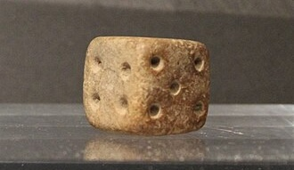

{{< interactive-figure probabilityDiceCover makeDiceCover options='{"outcomes":[3,4],"throwSeed":144,"shadowMapSize":1080,"throwSettings":{"startDistance":9,"startHeight":3.8,"forwardSpeed":15.9,"lift":0,"lateralSpeed":0.7,"spread":1.5},"gravity":77,"spinStrength":0.5,"camera":[-37.4,32,75],"cameraTarget":[0.1,0.7,-2.6],"fieldOfView":3}' fallback="Two oversized dice rolling into view and settling on a three and a four." >}}

In the previous chapter, we hinted at thinking probabilistically about extreme scores in a distribution. Here, we'll go into that idea in more detail. We'll think about what statisticians mean when they talk about probability and how we go about quantifying it. We'll need to introduce some new terminology, including random sampling and the normal distribution, and then we'll return to $z$ scores and see how a normal distribution lets us attach precise probabilities to regions of scores.

## A Brief History of Probability

People have been thinking about probability for a long time, at least in a broad sense. It's a useful thing to be able to make predictions about an uncertain future. What are the chances it will rain tomorrow? Can I kill this sabre-toothed tiger, or will it probably kill me first? How much crop should we plant to feed the group? For most of that history, there were no formal ways of articulating *how* probable something might be. The best people could do was offer rough verbal descriptions, like, "this will happen in most cases." Aristotle pointed out, for example, that if someone has a fever and you give them honey-water, for the most part they will get better. Sometimes they won't: it's not certain, but neither is it entirely unpredictable. It's something in between, more or less probable.

But *how much* more or less? The idea of representing uncertainty with numbers and reasoning about it mathematically was a relatively recent development. One of the early inspirations came not from life-and-death decisions but from games of chance. For thousands of years people have been playing games using bits of animal bone --- two-sided, coin-like worked and decorated pieces of bone, or astragali, the four-sided ankle bones of sheep and goats. Games played this way were so popular that some people even manufactured astragali out of clay, stone or glass.

.](resources/figures/astragal.jpg){#fig-astragal}

According to the card describing this glass astragal at the Metropolitan Museum of Art in New York, playing with them was so much fun that "knucklebones have been found in tombs where they must have been intended to help the deceased while away endless time." (So I guess, in a way, it *was* a matter of life and death.)

Astragali have four faces stable enough to land on, but the faces aren't the same size or shape, so the four results aren't equally likely. Eventually cubical dice replaced the irregular animal bones. The example below, something like 4,000 years old, even has the convention of opposite sides adding to seven that modern dice follow.

{#fig-old-dice}

These regularly shaped dice proved appealing to gamblers, and eventually to mathematicians, because it meant they could count outcomes and reason about them in a consistent way. No less a mind than Galileo took on a dice puzzle that required exactly the kind of careful counting we're about to do, so we'll come back to him once we have the same problem in front of us [@galileo1898dadi]. (Possibly Galileo took the puzzle on at the urging of a gambling duke hoping to gain an advantage, though in his report, Galileo tactfully omitted the name of the person who commissioned it.)

### Catan 

Let's think about a slightly more recent game, Catan. It's a board game played by rolling a pair of dice (not goat knucklebones, thankfully). The board consists of an arrangement of hexagonal terrain tiles. Each terrain produces a particular resource, such as wood or grain. We'll ignore the different types of resources: all that matters for us is that resources are good, so you want to get as many as possible. How do you get them? Well, most tiles also get a number token. (The tokens have little dots below their numbers, and some are red. I wonder why 😉.) Players place settlements at the corners where tiles meet. Every time the two dice are rolled, if their sum matches the number on a tile neighboring your settlement, you get to collect that resource. So when you decide where to place your settlement, you are choosing which dice totals you want to be paid by for the rest of the game. (I'm simplifying and ignoring other parts of the game so we can focus on this question of pure probability.)

Say you put a settlement at the top-left of the board below where the 2, the 10, and the 6 meet. You get resources whenever anyone rolls either 2, 10, or 6, because your settlement touches all three of those tiles.

So let's assume you get to go first. You have one settlement to place and you just want to maximize your chances of getting paid each time the dice are rolled. Where would you place your settlement? Pick a spot by clicking on the board below. No need to calculate anything; just go with what looks good.

::: {#fig-catan}
{{< interactive-figure catanBoardIntro makeCatanBoard options='{"mode":"choose","remember":"sfs-catan-choice"}' fallback="A schematic Settlers of Catan board: nineteen hexagonal tiles in three terrain colors, each except the central desert carrying a number from 2 to 12. Settlements go at the corners where tiles meet." >}}

A simplified Catan board. Settlements go at the corners where tiles meet, and the roll of two dice determines which tiles produce.
:::



## Defining Probability

Let's lay out some technical terms now, so that we have the precise language we need to reason about whether you picked the best spot when we circle back around to Catan in a few minutes.

First, what exactly do we mean by *probability*? Generally speaking, a probability model assigns probabilities to events according to a consistent set of rules. What rules? Well, there are distinct traditions and intense disagreement among statisticians and philosophers, which I am happy to sidestep for the most part. The approach that we will take is based in the frequentist tradition. It's not the only game in town, and it's not necessarily the best in every way, but it's the one that has dominated the social sciences for most of their history, and so its the one you ought to understand first.

So a probability, in the frequentist sense, is a number that describes what would happen if we could repeat something many times: the proportion of repetitions in which some event of interest would occur in the long run. It ranges from 0, meaning impossible, to 1, meaning certain. A probability of .5 means that, in the long run, we would expect the event to occur about half the time.

To nail this down more firmly, let's think about some simple situations in which there are a small number of equally likely outcomes that we can count. (Later, we’ll generalize the same ideas to situations where outcomes are not equally likely, and to continuous variables, where counting individual outcomes no longer works.) We'll need some terms:

- An **outcome** is one elementary result of a chance process.
- An **event** is the outcome or collection of outcomes we're actually interested in. 
- The **sample space** is the set of *all* the possible outcomes.

We use a capital letter $P$ to denote probability and put the event we're interested in inside parentheses. So $P(A)$ means the probability of Event A. When every outcome in the sample space is equally likely, we can find that probability by counting the outcomes in A and dividing by the total number of possible outcomes.

$$ P(A) = \frac{\text{number of outcomes in } A}{\text{total number of possible outcomes}} $$

This should make more sense with some concrete examples. If you flip a coin, there are two possible outcomes, heads or tails. The entire sample space consists of those two outcomes. If we want to denote the probability of heads, we would write $P(\text{heads}) = 1/2 = .5$. That's because heads is one of the two equally likely outcomes. (Effectively the event is the outcome; there's only one outcome that gets you heads.) Likewise, we would write the probability of tails as $P(\text{tails}) = 1/2 = .5$.

Or we can think about rolling a single fair die. If we're using a six-sided die, there are six equally likely outcomes in the sample space, the numbers one through six. So the probability of rolling a six is $P(6) = 1/6 \approx .17$.

Perhaps we're interested in the event of rolling an even number on a single six-sided die. Now we have an event that can be produced by more than one outcome. There are three individual outcomes (2, 4, 6) that would constitute that event. So the probability of rolling an even number is $P(\text{even}) = 3/6 = 1/2 = .5$.



### Rolling Two Dice

The same logic applies to rolling multiple dice; the sample space just expands, and we have to be careful about how to count things. In fact, this is what puzzled the 17th century gambler who reached out to Galileo to solve the puzzle [@galileo1898dadi]. They noted that some events seem to have the same number of ways of occurring. Like, if you roll a pair of dice, you might get a total of 6 or a total of 7. At first glance, there are three combinations of the numbers 1 through 6 that give a sum of 6: 1 and 5; 2 and 4; 3 and 3. Or you might get a total of 7. There are also three combinations that add up to 7: 1 and 6; 2 and 5; 3 and 4. But gamblers had noticed that 7 actually comes up more often than 6. How can that be, if there are the same number of ways to get each total?^[I'm simplifying history: Galileo was asked a slightly more complicated version of this puzzle involving three dice. But the point is the same.]

Galileo's answer was that those unordered combinations are the wrong things to count. We need to distinguish what each dice does. Did you notice the red and blue dice at the top of the chapter? Red landed on 3 and blue landed on 4, for a sum of 7. But what if red had instead landed on 4 and blue on 3? The total would have been 7 as well. So actually there aren't just 3 ways of getting 7, there are 6:

- (1,6)
- (6,1)
- (2,5)
- (5,2)
- (3,4)
- (4,3)

What about 6? The subtlety is that there's only one way that 3 + 3 can happen. Both dice have to come up 3. So the outcomes that produce a sum of 6 are:

- (1,5)
- (5,1)
- (2,4)
- (4,2)
- (3,3)

There are only 5 outcomes that give a sum of 6, and 6 that give a sum of 7! That's why 7 is more likely to come up.

$$
P(\text{sum of } 6) = \frac{5}{36} \approx .139
$$

$$
P(\text{sum of } 7) = \frac{6}{36} \approx .167
$$

We can run with the idea and make a table of the sample space for rolling two dice. Each dice can land on 1 through 6. We'll use those values for the blue dice as the columns, and the value of the red dice as rows. So a two on the first die and a five on the second is a different outcome from a five on the first die and a two on the second, even though both produce a total of seven. We have to count every combination.

|  | **1** | **2** | **3** | **4** | **5** | **6** |
|---:|:--:|:--:|:--:|:--:|:--:|:--:|
| **1** | 2 | 3 | 4 | 5 | 6 | 7 |
| **2** | 3 | 4 | 5 | 6 | 7 | 8 |
| **3** | 4 | 5 | 6 | 7 | 8 | 9 |
| **4** | 5 | 6 | 7 | 8 | 9 | 10 |
| **5** | 6 | 7 | 8 | 9 | 10 | 11 |
| **6** | 7 | 8 | 9 | 10 | 11 | 12 |

: The totals associated with all 36 ordered outcomes of rolling two dice. {#tbl-dice-sums}

$$ P(2) = \frac{1}{36} \approx .03 $$
$$ P(12) = \frac{1}{36} \approx .03 $$
$$ P(7) = \frac{6}{36} \approx .17 $$

If we take the 36 sums in the table and draw a bar graph, we can turn the counting we just did into a picture of probability. Rather than plotting the raw frequencies, we'll divide the frequency of each sum by 36. So the bar for 2 has a height of $1/36$, while the bar for 7 has a height of $6/36$.

::: {#fig-dice-sums-bar-graph}
{{< interactive-figure diceSumsBarGraph makeGraph options='{"type":"bar","scale":"proportion","data":[2,3,3,4,4,4,5,5,5,5,6,6,6,6,6,7,7,7,7,7,7,8,8,8,8,8,9,9,9,9,10,10,10,11,11,12],"aspectRatio":2,"labels":{"x":"Sum of two dice","y":"Probability"},"ariaLabel":"Bar graph showing the theoretical probability distribution for the sum of two dice. Separate bars for sums 2 through 12 have probabilities 1/36, 2/36, 3/36, 4/36, 5/36, 6/36, 5/36, 4/36, 3/36, 2/36, and 1/36."}' fallback="Bar graph showing the theoretical probability distribution for the sum of two dice, rising from 1/36 for a sum of 2 to 6/36 for a sum of 7, then falling symmetrically to 1/36 for a sum of 12." >}}

The probability distribution for the sum of two dice.
:::

We've made a useful move here. The table collects 36 individual outcomes, each equally likely. The graph groups those outcomes by the sum of the dice and divides each frequency by 36, so the height of each bar is the probability of that sum. The possible values of this new variable aren't equally likely: 7 gets six of the 36 outcomes, while 2 gets only one. Taken together, the bars form our first **probability distribution**. They show every possible value of the variable and the probability attached to each one, and their heights add up to 1.

One more thing to note. If we're interested in the probability of one event *or* another, we can add their probabilities together. For example, the probability of rolling a 5 or a 6 is:

$$ P(5 \text{ or } 6) = P(5) + P(6) = \frac{4}{36} + \frac{5}{36} = \frac{9}{36} \approx .25 $$



### Back to Catan

Remember in Catan a settlement neighboring three numbers pays out if the total rolled is any one of them.

$$ P(5 \text{ or } 6 \text{ or } 9) = \frac{4 + 5 + 4}{36} = \frac{13}{36} \approx .36 $$

All of that was done with a pencil. We counted outcomes we never actually observed, and announced how often things would happen without rolling anything. It's fair to ask whether the world agrees.

When we repeat a chance process, the proportion of trials on which an event actually happens is its **observed relative frequency**. We can use that relative frequency as an empirical estimate of the event's probability. Any one roll is unpredictable, but repeated rolls tend to settle into the pattern implied by the possible outcomes.

::::: {.callout-tip .interactive}
## Does the model survive contact with reality?

{{< interactive-figure
  probabilityDiceRoller
  makeDiceRoller
  options='{"seed":"probability-dice-v1559"}'
  fallback="Interactive roller for one to five dice with a histogram that accumulates the sums of repeated rolls."
>}}

{{< interactive-figure
  catanBoardVerdict
  makeCatanBoard
  options='{"mode":"rated","rating":"empirical","linkTo":"probabilityDiceRoller","remember":"sfs-catan-choice","showBoard":false}'
  fallback="The same schematic Catan board, with every corner shaded from blue to green according to how often it produced a resource across the rolls made so far."
>}}

:::: {.callout-footer}
::: {.tutorial-step data-title="One roll" data-action='{"rolls":1,"dice":2,"show-expected":false,"show-board":false,"animate":true}'}
Throw the dice. They tumble for a second and settle on something — and nothing we just worked out told you which of the 36 outcomes it was going to be. All that counting tells you what to expect. It can't tell you what you're about to get.
:::

::: {.tutorial-step data-title="A game" data-action='{"rolls":60,"dice":2,"show-expected":false,"show-board":false,"animate":true}'}
Now sixty rolls — roughly what a full game of Catan gets through. The broad shape is right: the middle is taller than the ends. But look at the detail. Seven, the most likely total of all, came up four times. Three, which should be scarce, came up ten. Over a game's worth of rolls the model is a rough guide, not a description.
:::

::: {.tutorial-step data-title="On the board" data-action='{"rolls":60,"dice":2,"show-expected":false,"show-board":true,"rating":"empirical","highlight":"reader","animate":true}'}
Here's what those sixty rolls would have meant on the board. Every corner is shaded by how often it actually paid out: green for the productive spots, blue for the barren ones. If you picked a corner, it's circled. Eight corners here are exactly tied on paper — each pays on 10 of the 36 outcomes — and after sixty rolls they range from 20% to 50%. Identical probabilities, wildly different results.
:::

::: {.tutorial-step data-title="A thousand" data-action='{"rolls":1000,"dice":2,"show-expected":false,"show-board":true,"rating":"empirical","highlight":"reader","animate":true}'}
A thousand rolls — more Catan than anyone plays in a year. The histogram is turning into a clean staircase up to seven and back down. On the board, those eight tied corners have pulled back together: they now sit between 27% and 30%, and the corner that was really best has climbed to the top where it belongs.
:::

::: {.tutorial-step data-title="A million" data-action='{"rolls":1000000,"dice":2,"show-expected":true,"show-board":true,"rating":"empirical","highlight":"reader","animate":true}'}
A million simulated rolls, with the theoretical distribution laid over the bars. The observed relative frequencies now sit almost exactly on top of the theoretical probabilities. We calculated that pattern by counting 36 outcomes on paper, without rolling anything, and a million repetitions have made it visible. This is the law of large numbers doing its work.
:::

::: {.tutorial-step data-title="Your corner" data-action='{"rolls":1000000,"dice":2,"show-expected":true,"show-board":true,"rating":"theory","highlight":["reader","best-chance"],"animate":true}'}
So we can stop rolling and go back to counting. Every corner is now shaded by the probability we can work out from the table rather than by anything the dice did — and it's the same map. Your corner is circled, and the best one on this board, the 5–6–9 corner up near the top, is marked. It produces something on $13/36 \approx .36$ of rolls, and nothing else on the board gets past $10/36$.
:::

::::

:::::

### Was Your Settlement a Good Bet?

The best corner on this board is the one where the 5, the 6 and the 9 meet, up near the top. It pays out on 13 of the 36 possible outcomes — that's the $P(5 \text{ or } 6 \text{ or } 9) = 13/36$ we worked out a moment ago, about .36 — and nothing else on the board gets past $10/36$. So if you picked it, nice work.

But the more interesting thing is what it took to know that. Watching one game's worth of rolls wouldn't have told you. After sixty rolls, the 5–6–9 corner was sitting in fourth place, behind three corners with lower theoretical probabilities. Eight corners on this board have *exactly* the same probability as each other, and after sixty rolls one of them had produced on half the rolls and another on a fifth of them. Nothing distinguished those eight except luck, and luck had spread their observed relative frequencies from 20% to 50%. It took a thousand rolls to squeeze them back to between 27% and 30%, and a million before the picture the dice painted was the picture we had already worked out by counting.

That's the whole argument for doing the counting. A run of results is a noisy, misleading guide to the process that produced it, and the shorter the run, the more misleading it gets. The 36 outcomes in that table were there all along, and they were right on the first roll — they just weren't visible in the first roll, or the first sixty. We'll spend the rest of this book in exactly that gap: what you can conclude about a process from a limited number of observations of it.

This tendency for an observed relative frequency to settle toward the underlying probability as the number of trials increases is called the **law of large numbers**. It does not say that a short run must look right, that the fit will improve smoothly with every new roll, or that seven is guaranteed to appear exactly one-sixth of the time. It says that sustained discrepancies become less likely as the same chance process is repeated over and over.

Of course, that doesn't make 5–6–9 the best place to settle in every meaningful sense. In a real game, it matters which resources those tiles produce, what you're trying to build, what the other players have already taken, whether the robber gets in the way, and what you might be able to trade. We defined “best” narrowly as the greatest probability of producing at least one resource on a roll. You can calculate precise probabilities but it won't win every game for you.

## Probability with Marbles

Okay, rolling dice is fun, but every statistics textbook I've ever read has used the idea of picking marbles out of a jar to illustrate ideas of probability, so it would be remiss of me not to.

Actually, the idea has a long and distinguished pedigree. In *The Art of Conjecturing*, published in 1713, Jacob Bernoulli asked his reader to imagine an urn containing 5,000 pebbles, in some unknown ratio of white to black. (This might sound quaint and arbitrary, but apparently urns of pebbles we used to cast votes in elections at the time, so Bernouilli may have been thinking about a very real issue.) If you were to reach in and randomly draw one black pebble, then one white pebble, and so on, you would eventually get a sense of the ratio of black to white pebbles in the urn. Eventually you could infer the hidden composition of the urn from the relative frequencies they observed? Bernoulli proved that, as the number of draws increased, the observed proportion would become increasingly likely to fall close to the true proportion. This was the result we now call the law of large numbers [@bernoulli2006conjecturing].

So the urn wasn't just a convenient container. It let Bernoulli connect a probability he could calculate by counting the contents with a probability someone could estimate from repeated observations. It also made a seemingly small procedural detail — putting each pebble back — mathematically important. We'll use a slightly less crowded jar to see why.

The idea is basically the same as the coins or dice. If every marble is equally likely to be selected, we can treat each marble as one outcome. Knowing how many marbles there are in total, and how many of them have a particular color, then allows us to calculate the probability of selecting that color.

So let's say we have a jar which contains 25 white marbles and 25 blue marbles. Say we want to know the probability of reaching in and randomly drawing out a white marble. The probability of selecting a white marble is 25 (since there are 25 white marbles) over 50 (since there are 50 marbles in total), which gives us a probability of $25/50$, which can be simplified to $1/2$, or .5. The useful thing about the jar metaphor is we can change around the numbers of marbles arbitrarily. So say instead we have a jar with 40 blue marbles and 10 white. Now, the probability of randomly selecting a white marble is $10/50$, or $1/5$, or .2.

### Sampling With and Without Replacement

Now we want to think about repeated sampling — the probability of drawing certain marbles when we select more than one. Let's say we're going to pick out two marbles. The probability of the first one being white is still $10/50$, or .2. But what is the probability that our second marble will be white?



Sorry for the little trick there. The probability of the second marble being white actually depends on how exactly we're doing our sampling. Specifically, it depends on whether we put the first marble back into the jar before we take the second one. This is the distinction between sampling with and without replacement.

If we sample **without replacement** — that is, we get a white marble first and don't put it back before taking a second marble — then the probability of the first marble being white is $10/50$, or .2. But the probability of the second marble being white, **given that** the first was white, is $9/49$, or about .184, because there are now only nine white marbles and 49 marbles in total. This is a **conditional probability**: the probability of one event once we know that another event has happened. We can write it as $P(\text{second white}\mid\text{first white})$. To find the probability that **both** events happen, we multiply the probability of the first by this conditional probability:

$$P(\text{first white and second white}) = \frac{10}{50} \times \frac{9}{49} = \frac{90}{2450} \approx .0367$$

On the other hand, if we sample **with replacement**, we put the first marble back. The jar's composition is unchanged, so the probability of white on the second draw is still $10/50=.2$, regardless of the first result. Two events are **independent** when knowing that one happened does not change the probability of the other. So these two draws are independent, and the probability that both marbles are white is therefore $.2 \times .2 = .04$.

### Random Sampling

Sampling with replacement matters in the marble example because it makes successive draws independent. But replacement and random sampling are not the same thing. A **random sample** is selected by a chance procedure rather than by someone's convenience or judgment. We can take a random sample without replacement — in fact, that's how people are commonly sampled, since we don't usually want to select the same person twice. The selections are still random even though the first one changes the probabilities for the next one.

One common design is a **simple random sample**, in which every possible sample of a given size has the same chance of being selected. An **independent random sample** goes further: each observation is randomly drawn from the same population, and learning which observations were selected earlier does not change the probability of the next one. Sampling with replacement gives us that independence in the jar, but it isn't part of the definition of random sampling.

Social scientists don't usually put people back into the population and risk selecting them again. Strictly speaking, then, sampling without replacement from a finite population makes the selections dependent. But if the population is very large compared with the sample, the dependence is usually negligible. Removing one person from a city of a million barely changes the makeup of the people who remain, just as removing one marble from a jar containing a million would barely change the probability on the next draw. In that situation, treating the observations as approximately independent is a useful simplification.

The size of the population only smooths over the particular bump caused by sampling without replacement. It does not rescue a biased sampling frame, nonresponse, or a sample full of people whose scores are related because they belong to the same family, classroom, or neighborhood. Independence is a claim about how the observations are connected, not just a synonym for “random.”



## Probability and Distributions of Scores

Moving on from coins and dice and jars, we can also think about probabilities for distributions of scores. With a small, finite set of observed scores, the same counting logic applies. We just need to know the total number of equally likely possibilities and the number of outcomes in the event we're interested in. Then we can calculate the probability of selecting a score equal to a certain value, greater than a certain value, or within a certain range.

Take this little distribution of ten scores.

{{< interactive-figure probabilityBlocksDemo makeGraph options='{"type":"block","data":[1,1,1,1,2,2,2,4,4,5],"xDomain":[0,6],"xTickValues":[1,2,3,4,5],"labels":{"x":"Scores","y":"Frequency"}}' fallback="Block histogram of ten scores: four 1s, three 2s, two 4s, and one 5." >}}

If we select one score at random, each of the ten blocks is one equally likely outcome. Let $X$ stand for the value of the score we select. Four of the ten blocks have a value of 1, so:

$$ P(X = 1) = \frac{4}{10} = .4 $$

There are no blocks at 3, so $P(X=3)=0$. And we can define events that collect several values at once:

$$ P(X \ge 4) = \frac{3}{10} = .3 $$

$$ P(1 < X < 5) = \frac{5}{10} = .5 $$

Taken together, the probabilities attached to all the possible values of $X$ form a **probability distribution**. It tells us not only which scores are possible but how likely each one is. Because one of the possible values must be selected, the probabilities across the whole distribution add up to 1. Here we obtained those probabilities by dividing the frequency at each score by ten. In other words, the block histogram can do double duty: it shows the distribution of ten observed scores, and, if one of those ten blocks is going to be selected at random, it shows the probability distribution for the value we will get.

## The Normal Distribution

What if the distribution isn't a little collection of ten discrete blocks we can count one by one? What if we're interested in a population, for which we don't even know the individual scores? We can't count the values, but we can model its probabilities mathematically.

This is where the normal distribution comes in. French mathematician Abraham de Moivre discovered the normal curve while thinking about the long-run probabilities of simple events with two equally-likely outcomes, like a coin toss. Like we saw earlier, for a fair coin, each outcome (heads or tails) has a probability of $.5$. But what happens when you toss a coin a bunch of times, say 3,600? Will you get precisely half---1,800---come up heads? Probably not. Toss the coin another 3,600 times and you'll get a different answer again. If you had the time to do this again and again, the answers would usually be somewhere close to the expected 1,800; rarely will it be far away. De Moivre realized that we can approximate the distribution that all these outcomes would follow with a simple smooth curve---the bell-shaped curve that we now call the normal distribution.

The usefulness of the normal distribution is that it is a precisely mathematically defined shape. Here is the equation:

$$Y = \frac{1}{\sqrt{2 \pi \sigma^2}} e^{-\frac{(X-\mu)^2}{2\sigma^2}}$$ {#eq-normal-distribution}

Now, you don't really have to know this equation for the work we're going to do throughout this book. So if it makes you sweat just looking at it, don't worry. But it is worth looking at briefly to get a sense of how it's constructed. It has an $(x-\mu)^2$ in there, which should look familiar from our chapter on variability, and $\sigma$ is part of this too, so variability has something important to do with the shape. The value $Y$ gives the height of the curve (its *density*) at a particular value of $X$. But again, don't worry about remembering the specifics. Just know that the equation defines the curve precisely. The value of this for us is that we can find the area under the curve between two values, and that area gives us the probability of an outcome falling within that range.

This is the insight that sets us up for much of the inferential statistics ahead. A normal distribution is completely specified by its mean and standard deviation. If a population can be reasonably modelled by a normal distribution, we can determine the probability associated with any region of scores without recording and counting every individual score.

### Areas Under the Normal Curve

And again, because this is a mathematically defined curve, we can determine the area underneath any given section of it. The total area under the curve is 1. The proportion of that area in a region is the probability of a randomly selected score falling in that region, according to the model.

It is often easiest to work with the **standard normal distribution**, also called the **unit normal distribution**. This is simply a normal distribution with a mean of 0 and a standard deviation of 1. The $z$ scores we learned to calculate in the previous chapter put scores onto that standard scale, so the same set of areas can be used for any normal distribution.

So, for example, 34.13% of the area of the curve lies between the mean and one standard deviation above the mean. And because it's symmetrical, the same 34.13% lies between the mean and one standard deviation below the mean. Another 13.59% lies between one and two standard deviations from the mean on each side. And 2.28% lies more than two standard deviations above the mean, with another 2.28% more than two standard deviations below it. Together, the two extreme regions contain about 4.56% of the distribution. This is why we said in the previous chapter that scores more than two standard deviations from the mean are unusual under a normal model.

{{< interactive-figure zRegionsLabelled makeDistributionGraph options='{
  "distribution": "normal",
  "xDomain": [-4, 4],
  "xTicks": 9,
  "style": "minimal",
  "xAxis": true,
  "yLabel": false,
  "labels": {"x": "z-score"},
  "markers": [
    {"at": -2, "label": false, "color": "var(--graph-axis-color, #7b818a)", "dash": "3 4", "strokeWidth": 1.2},
    {"at": -1, "label": false, "color": "var(--graph-axis-color, #7b818a)", "dash": "3 4", "strokeWidth": 1.2},
    {"at": 0, "label": false, "color": "var(--graph-axis-color, #7b818a)", "dash": "3 4", "strokeWidth": 1.2},
    {"at": 1, "label": false, "color": "var(--graph-axis-color, #7b818a)", "dash": "3 4", "strokeWidth": 1.2},
    {"at": 2, "label": false, "color": "var(--graph-axis-color, #7b818a)", "dash": "3 4", "strokeWidth": 1.2}
  ],
  "shade": [
    {"to": -2, "label": "percent", "color": "var(--sfs-accent, #2c7fb8)", "opacity": 0.12},
    {"between": [-2, -1], "label": "percent", "color": "var(--sfs-accent, #2c7fb8)", "opacity": 0.22},
    {"between": [-1, 0], "label": "percent", "color": "var(--sfs-accent, #2c7fb8)", "opacity": 0.38},
    {"between": [0, 1], "label": "percent", "color": "var(--sfs-accent, #2c7fb8)", "opacity": 0.38},
    {"between": [1, 2], "label": "percent", "color": "var(--sfs-accent, #2c7fb8)", "opacity": 0.22},
    {"from": 2, "label": "percent", "color": "var(--sfs-accent, #2c7fb8)", "opacity": 0.12}
  ],
  "animate": true
}' fallback="Standard normal curve divided at z = -2, -1, 0, 1, and 2, with each region labeled by the percentage of the distribution it contains: 2.28%, 13.59%, 34.13%, 34.13%, 13.59%, and 2.28%." >}}

Of course, we aren't limited to those particular regions. We can take any $z$ score and determine the area — that is, the probability of a score falling above or below that value under a standard normal model. The region beyond a cutoff at either end of the distribution is called a **tail**.

### The Unit Normal Table

In the olden days, you would look up something called a $z$ table, a standard normal table, or a unit normal table. Printed tables vary in how they're arranged. The one below lists $z$ scores along with the areas to their left, to their right, and between the mean and the score. (Computers have made these tables largely obsolete, but it's useful for us to see how they work, because whatever statistical software you might use in practice is applying the same logic and math.)

{{< interactive-figure unitNormalTable makeCriticalValueTable options='{"distribution":"normal","layout":"areas","z":{"from":0,"to":3,"step":0.01},"zDigits":2,"areas":["left","right","mean-to-z"],"tableMaxHeight":"18rem","selected":false}' fallback="Unit normal table showing areas to the left, right, and between the mean and z." >}}

So for a $z$ score of zero, it's exactly half and half; 50 percent of the distribution lies on either side of zero, because zero is the mean and the distribution is symmetrical. In other words, under a normal model there is a 50 percent chance of observing a score greater than the mean and a 50 percent chance of observing a score lower than the mean.

If we take a $z$ score of 1, we look for that row in the table. The area to the left of $z=1$ is about .84, so roughly 84 percent of the distribution lies below it. In percentile language, a score with $z=1$ is at about the 84th percentile. The area to the right is just under .16, and the area between the mean (where $z=0$) and $z=1$ is .3413, just like we saw before.

Or take a $z$ score of negative one. Now the smaller area is to the left of the score and the larger area is to its right. Printed standard normal tables don't always list negative $z$ scores, because the symmetry of the distribution means the relevant areas are the same as for a positive $z$ score on the opposite side of the mean.



### From Areas to Quantiles

So far, we've started with a score and asked for an area: what proportion of the distribution falls below $z=1$? Sometimes we want to go the other way. A **quantile** is a cutoff with a specified proportion of the distribution at or below it. The median, for example, is the .50 quantile. In a normal distribution it sits at the mean, because half the area is on either side.

Percentiles are quantiles expressed as percentages. Saying that $z=1$ is at about the 84th percentile means that it is the cutoff with about 84% of the distribution below it. Or suppose we wanted the 95th percentile. We would search the table's left-area column for .95 and find that the answer lies about halfway between $z=1.64$ and $z=1.65$, or roughly 1.645. The machinery is the same; we've just reversed the question. A score gives us an area, while a quantile gives us the score that cuts off a chosen area.

## Applying Probability: Spider-Man

To finish up, let's turn back to our silly Spider-Man reaction time test from the previous chapter. We found that Peter Parker's $z$ score was $-2.5$, and we said that that seemed pretty extreme. But now we're equipped to determine probabilities under a normal model, and we can be more precise.

Peter has already recorded his score, so it doesn't make sense to ask for the probability that *he* got it. The relevant question is this: if we randomly selected someone from our reference population of ordinary, unbitten people, what is the probability that they would have a reaction time as quick as Peter's or quicker? As you can see on the normal curve, reaction times that fast make up a very small lower-tail region of the distribution.

::: {#fig-spiderman-z-score}
{{< interactive-figure spideyProbabilityCurve makeDistributionGraph options='{"distribution":"normal","xDomain":[-4,4],"xTicks":9,"style":"minimal","xAxis":true,"shade":{"to":-2.5},"markers":{"at":-2.5,"label":"z = −2.5","height":0.45,"color":"var(--sfs-accent, #2c7fb8)"},"animate":true,"labels":{"x":"z-score"}}' fallback="Standard normal curve with a vertical line at z equals negative 2.5 and the small region below it shaded." >}}

A normal distribution curve with a vertical line at $z = -2.5$, representing the position of Peter Parker's reaction time within the standardized population distribution.
:::

If we look up $-2.5$ in the unit normal table, it tells us that only about .0062 of the distribution is down there in the lower tail, or 0.62%:

$$P(Z \le -2.5) \approx .0062$$

In other words, if we tested a random individual from this population, there's less than a 1% chance that they would be as quick as or quicker than Peter Parker. That is evidence against the idea that Peter is just an ordinary member of the reference population. It isn't proof: rare scores do sometimes happen, and this probability is not itself the probability that the spider bite changed him. But it gives us a more precise reason to begin suspecting that something unusual is going on. In [Chapter 8](08-hypothesis-testing.qmd), we'll develop that logic into a formal hypothesis test.



### A Note on Normality

One last thing to note: these particular probabilities come from a normal model. If the population distribution has a different shape — say, if it's strongly skewed or bimodal — the normal curve's areas might not describe it well. So in practice we don't simply assume that every distribution is normal, and we can't conclusively “verify” normality from a finite set of observations. We assess whether a normal model is reasonable enough for what we're trying to do.

The objects have changed over the course of the chapter — dice outcomes, marbles, blocks in a histogram, areas under a curve — but the underlying question has stayed the same. What are the possible results, and how much of that possibility belongs to the event we care about? In the next chapter, we'll ask that question about sample means. And we'll see an important complication: under certain conditions, a distribution of sample means can be approximately normal even when the population of individual scores is not.
