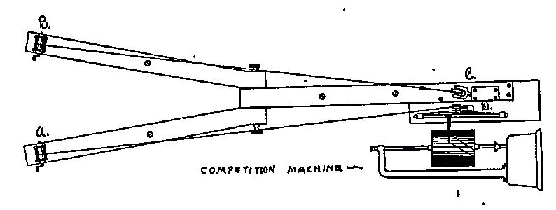

## Introduction

This will be our last lecture on the $t$ statistic. We'll introduce one more variant of the $t$ test, the related samples $t$ test, which is used when we want to compare two samples but the two samples are somehow related, most often by consisting of the same people. We'll discuss the kind of research designs that this involves, the pros and cons of related and independent designs, and we'll learn how to calculate the related samples $t$ test, paying attention to how it differs from the independent samples $t$ test.

## Research design: Between-participants vs. within-participants

Understanding the applications of the related samples $t$ test requires us to think some more about research design. The design that calls for an independent samples $t$ test, like we learned about in the previous lecture, is also known as a "between-participants" design. That's because the different experimental treatments, whatever they are, are administered between the different groups of participants. By that I mean that each participant only experiences and contributes data to a single condition of our study.

In the example where people are given ten dollars and told either to spend it on themselves or someone else, everyone does just one or the other, not both. So because it's a completely different group of people in each sample, there are at least two reasons why our sample means might differ from one another. One is any treatment effect that increases or decreases scores overall. That's what we're hoping to discover. But another reason is just the individual differences between those different groups of people. Because of sampling error, the natural discrepancy between samples and their populations, one group might have a few more people who score high on our measure and the other group a few more people who score low. With this little abstract illustration, the average color of the dots might be a bit different between the two groups even if there's no treatment effect, no systematic difference between the groups, simply because we ended up with a sample consisting of dots that lean towards one hue more than another, just by random sampling error alone. With large enough samples, differences like these should pretty much balance out. But those individual differences are a potential source of variability that we have to keep in mind.

Now, compare that to a related samples design, which is also called a "within-participants" design. That's because the different experimental treatments are administered within our sample of participants, meaning that every participant experiences and contributes data to all treatment conditions. Here we get two scores from each person, one for each condition — unlike the between-participants design where we have different people in each treatment group and record just one score from each person. As a result of this design, individual differences theoretically cannot contribute to any difference we find between the two conditions. There are still individual differences within each sample, because each sample is full of a bunch of different people, or different colored dots here. But it's those same people, or dots, in each sample. They don't differ. And so overall, the two samples are the same. Theoretically, any difference between sample one and sample two can't be due to individual differences. It has to be due to the treatment effect. As usual, reducing variability is a good thing for our hypothesis test. So by reducing or eliminating that source of variability between groups, we end up with a more powerful test statistic.

### Matched-subjects design

Another variation of the related-samples design is what's called a matched-subjects design. We have two samples of different people, like the independent samples design. But here each individual in sample A is matched on relevant variables with an individual in sample B. To take a kind of silly example, say we're doing our ten dollar, spend on yourself or someone else, study. And say we think that people's height could be a factor. We think for some reason that tall people are generally happier than short people. We want to make sure that that doesn't end up causing a difference between our samples. We want any difference to be just about the spending behavior. So we might make sure that every individual in sample A is paired up with someone of exactly the same height in sample B. This way we eliminate height as a potential source of difference between the groups because we're making sure that the pairs of scores we obtain for sample one and sample two are equivalent in height. So height can't be causing any difference in their reported happiness.

That's obviously a kind of dumb example, but real researchers can use this technique to control for things like socioeconomic status, education, and other demographic factors like that when it's not feasible to just have the same exact people in both treatment conditions of our study. And so it approximates the advantages of the repeated measures design, at least as far as the variables we've decided to match people on.

One thing worth pointing out, though, is that by using the same people in each sample, we cut the number of participants we need to recruit in half. But if we're just matching subjects like this, we still need the full amount, the same as if we were running a true independent-samples study. But again, we will end up with a more powerful test by canceling out variability due to the individual differences that we have matched our subjects on.

### Advantages and disadvantages

As far as advantages and disadvantages go, the required number of participants is kind of a big deal. Participants can be expensive and time consuming to recruit, especially if we're not just using intro psych students and giving them course credit. So cutting the number of participants we need in half can be a practically very useful thing to do. It also allows us to study changes within individuals over time. This is often used, for example, to study the efficacy of some psychological treatment or therapy for some psychological disorder. Again, we assume that the people we're studying aren't changing too much on psychological traits that we think are stable. So any difference between time one and time two must be due to whatever treatment we administered. And again, statistically, the main advantage is that related samples designs reduce or eliminate individual differences as a source of variability between groups. And the less variability in scores, the more powerful our statistical test.


There are disadvantages as well, though. If you think about it for a moment, factors besides our experimental treatment may cause people's scores to change during the time between measurements. To stick with the idea of a literal treatment for some disorder, say we find that people's symptom severity is reduced between time one and time two. It's possible that whatever treatment we administered in between times caused the improvement, but maybe something else did, or maybe their symptoms would have just gotten better anyway, even without our treatment.

Another potential logistical problem is that participation in the first treatment may influence people's behavior in the second treatment. This is known as an order effect. Suppose we run our study of giving people ten dollars as a within-participants design. We give people ten dollars to spend on themselves. And then the next day we give people ten dollars to spend on someone else. The fact that we just gave them ten dollars a day before might change how they act. Maybe they'll feel like they have to do something different. Or maybe they guess what we're up to and they report their happiness a little differently than they would have otherwise. There are potential remedies for these kind of problems. Counterbalancing can be a way to reduce order effects by having some people do treatment one followed by treatment two, and other people do treatment two first, followed by treatment one. But this isn't always feasible.

Finally, another logistical problem is that participants might drop out. I mentioned the benefit of requiring fewer participants, but it can also be logistically trickier to keep track of all those participants and to make sure they fully complete every condition of our study. Especially for studies where we want to follow up with people after some lengthy treatment, people can drop out of our study. And so we may need to recruit more people than we ideally need to, to compensate for that.

## Data structure and difference scores

Before we get into calculating this $t$ statistic, let's just look at some example data to see how we're going to treat it conceptually and how we begin dealing with it mathematically. First, let's recap the conceptual structure of an independent samples design. We have two independent samples of scores which we use to infer and compare the characteristics of their two respective populations.

At first, the structure of the data for the related samples design looks similar. We have two samples of scores, but crucially, the two samples are no longer independent. They consist of the same people, or people we've deliberately paired up to be similar. So if we treated this data the same way we treat the independent samples data, we'd be violating the assumption of independence of scores.

| Sample A | Sample B |
|:--:|:--:|
| 54 | 43 |
| 67 | 57 |
| 38 | 39 |
| 46 | 41 |
| 42 | 36 |

So rather than treating the two sets of scores separately, we turn them into a single sample of scores. And we do that by simply calculating the difference between them for each row, meaning each participant's pair of scores. We subtract the second from the first to get the difference score, and we can put that as a new column in our table.

| Sample A | Sample B | $D$ |
|:--:|:--:|:--:|
| 54 | 43 | $-11$ |
| 67 | 57 | $-10$ |
| 38 | 39 | $1$ |
| 46 | 41 | $-5$ |
| 42 | 36 | $-6$ |

So once we calculate the single sample of difference scores, we're back conceptually closer to the single-sample $t$ test that we first worked with. We have a single sample of these difference scores and we want to know the characteristics of the population of difference scores that produced our sample of difference scores.

## The related samples $t$ formula

Remember that the basic structure of all $t$ tests is this: a sample statistic minus a population parameter, which is derived from our null hypothesis, divided by an estimated standard error. For the single-sample $t$ test, this took the form of $M - \mu$ over $s_M$, the estimated standard error of the mean. $\mu$, the population mean, came from our null hypothesis, which we derived from some practical or theoretical knowledge, like expecting that the population average sleep duration should be eight hours, or that the midpoint of a scale should be the population average score for that scale. For the independent-samples $t$ test the equation was a bit more complicated. The statistic was the difference between sample means. The parameter was the difference between population means, which the null hypothesis told us should be zero. And the denominator was the estimated standard error of the mean difference.

Conceptually, the related samples $t$ test is most similar to the single-sample $t$ test. You can see all we've done is append a subscripted $D$ after all the symbols to denote that we're dealing with a sample of difference scores rather than regular scores. The statistic is the mean of the difference scores, $M_D$, and the denominator is the standard error of the difference scores. The population parameter is the mean of the population of difference scores, $\mu_D$. And maybe you can guess what the null hypothesis will tell us about that. According to the null hypothesis, that parameter should be equal to zero, meaning that we expect no difference on average. So if anything, this is the simplest equation yet, because when we come to calculate the numbers, we can just ignore that zero and just divide the mean of the difference scores by the estimated standard error of the difference scores to find out how much more of a difference we saw than we would expect due to sampling error alone.

## Calculating the related samples $t$ statistic

So here's how calculating the related samples $t$ statistic goes. First, we need to calculate the difference scores by subtracting scores of the second sample from the first. Remember, we typically refer to a set of scores with an $X$, so $X_B - X_A$ just means we go through the data row by row, subtracting one score from the other. Once we have all those difference scores, we can calculate the mean of the difference scores, $M_D$, just like calculating any other mean. It's the sum of the difference scores over the number of difference scores. And notice that with a repeated-measures, within-subjects design, $n$ is the number of participants in our study. But with a matched samples design, it's half the number of participants. Then we calculate the standard error of the mean difference, which is the standard deviation of the difference scores over the square root of $n$, the number of difference scores. And then we can calculate our $t$ statistic by taking the mean difference minus the population mean difference, which, again, is zero — so it's kind of irrelevant to the actual math — divided by the estimated standard error of the mean difference. As usual, we'll need to know the degrees of freedom for the $t$ test, which in this case is $df = n - 1$, meaning the number of difference scores minus one.

## Example: Triplett's social facilitation study

As usual, let's work through a quick example of hypothesis testing with this new kind of $t$ test. For this we'll use the example of Norman Triplett's study of what is now known as social facilitation [@triplett1898dynamogenic]. This is the idea that we perform some kinds of tasks better when we're competing against someone else rather than just doing it alone. Triplett first examined this in data from cycling competitions where racers either performed against each other or alone against the clock. Triplett's research was some of the earliest in all of social psychology. He published it in 1898. In fact, statistical techniques like the $t$ test hadn't been invented at the time. Triplett simply collected and graphed the data looking for patterns. And as you can see, the lower line, meaning the slower cyclists, were those who were running the race individually rather than competing directly against other cyclists.

{#fig-triplett}

But Triplett realized he needed some more convincing, more carefully controlled data. So he devised a clever apparatus to study this in a lab. It was a competition machine designed as a children's game whereby two kids could compete with each other. Two fishing reels were secured to the end of a Y-shaped apparatus that was clamped on top of a heavy table. Bands of silk cord were run over the axles of the reels and across two pulleys, so that turning the reel would cause a small flag sewn into the silk to traverse the length of the four-meter circuit. The task was to turn the reel and complete the circuit four times as quickly as possible. Triplett had children do this a number of times, either by themselves or racing against another kid who was doing it standing right next to them.

### Comparing independent and related samples approaches

This makes for a good example for us, because there are a number of different ways of comparing the data. We could take each child's first score when they performed either alone or in competition and compare those sets of scores as independent samples. Or we could take pairs of scores from each child, both when they performed alone and when that same child performed in competition, and we could look at the difference in the children's own scores as a related-samples $t$ test. Here we'll try both approaches using the exact same data to see how the different statistical tests compare, and can lead to different answers even when we feed in exactly the same numbers.

So here are those same numbers, and they're actually some of the real numbers from Triplett's study — the times, in seconds, that five children took to complete the reel-turning circuit alone and in competition. Each row comes from a single child. And so this data should properly be treated as a within-subjects design and the related-samples $t$ test used. But we're going to mishandle the data first. We're going to treat it as if each sample is made up of different kids. So we'll use the independent samples $t$ test.

| Participant | Alone | Competition |
|:------------|--:|--:|
| Violet F. | 54 | 43 |
| Anna P. | 67 | 57 |
| Willie H. | 38 | 39 |
| Bessie V. | 46 | 41 |
| Howard C. | 42 | 36 |

: Times (in seconds) from Triplett's competition-machine study. {#tbl-triplett}

{#fig-triplett-data}

So see if you can calculate the independent-samples $t$ statistic for this data.



This will be good practice for seeing if you understand how to do it. You can either do it with paper and pencil or you can use R if you look ahead to the instructions in the next problem set on how to do $t$ tests in R.

### Independent samples approach (incorrect for this data)

So let's say we state a nondirectional hypothesis. Our alternative hypothesis is that there will be a difference and our null is that there will be none. With a two-tailed test, an $\alpha$ of .05 and degrees of freedom of eight, because we're acting as if we have 10 participants total, and degrees of freedom for the independent samples test is $df = N - 2$, our critical $t$ values are $\pm 2.31$. We can calculate the sum of squared deviations, variance, and standard deviation for each sample in the usual way. The pooled variance comes out at 99. The estimated standard error of the mean difference is 6.29. And the $t$ statistic itself works out to 0.99. So we fail to reject the null hypothesis here. The difference between the means was in the direction of kids performing better in competition than alone, as we expected. But it was not an extreme enough difference that we could reject our null hypothesis.

### Related samples approach (correct)

But remember, we were mistreating the data by using an independent-samples $t$ test. Mathematically, it worked, and we got an answer. But it was not the appropriate test, because each row of the data actually came from the same child. We should be using the related-samples $t$ test here. So let's try the procedure again but using the related-samples $t$ test.

<!-- [Note: Original lecture included an interactive element here.] -->

We start with our hypotheses.



As usual, the nondirectional alternative hypothesis here would be that there is a difference in the kids' scores alone vs. in competition, that the mean of the difference scores is not equal to zero: $H_1: \mu_D \neq 0$. The null would be that the mean of the difference scores is equal to zero — that there is no difference in their performance, either alone or in competition: $H_0: \mu_D = 0$.

The critical regions for the test will depend on different degrees of freedom. Now for the related-samples test, degrees of freedom is $n - 1$, meaning the number of difference scores minus one. So here it would be four. And the critical values for a two-tailed $\alpha$ of .05 with four degrees of freedom would be $\pm 2.78$. Notice that this is more extreme than the critical values for the independent-samples test. And that's because of the different degrees of freedom. It's lower here, which means a more variable $t$ distribution, meaning the distribution has a lower peak in the middle and more of the distribution is further out in the tails. So we need a more extreme $t$ statistic to reject the null hypothesis. But remember, the advantage of this test is that we're ruling out a potential source of variability in the data from individual differences. And so even though the test is more stringent in the sense of requiring a more extreme $t$ to reject the null hypothesis, we should have a more powerful statistic because of the reduced variability in the data.

To calculate our statistic, we work with the difference scores just like any single sample of scores: find their mean, then their deviations from that mean, squared deviations, sum of squares, variance, and standard deviation.

| Participant | Alone | Comp | $D$ | $D - M_D$ | $(D - M_D)^2$ |
|:------------|--:|--:|--:|--:|--:|
| Violet F. | 54 | 43 | $-11$ | $-4.8$ | 23.04 |
| Anna P. | 67 | 57 | $-10$ | $-3.8$ | 14.44 |
| Willie H. | 38 | 39 | $1$ | $7.2$ | 51.84 |
| Bessie V. | 46 | 41 | $-5$ | $1.2$ | 1.44 |
| Howard C. | 42 | 36 | $-6$ | $0.2$ | 0.04 |

: Difference scores and their deviations. $M_D = -6.2$; $SS = 90.8$; $s^2_D = 22.7$; $s_D = 4.76$. {#tbl-triplett-differences}

$$s_{M_D} = \frac{s_D}{\sqrt{n}} = \frac{4.76}{\sqrt{5}} = 2.13 $$

$$ t = \frac{M_D - \mu_D}{s_{M_D}} = \frac{-6.2 - 0}{2.13} = -2.91 $$

Calculating our statistic, the standard error comes out to 2.13 and the $t$ statistic comes out to $-2.91$. So now notice how much more extreme that $t$ value is than the independent-samples $t$ that we calculated before. Again, we've used exactly the same data. Nothing changed here except that we acknowledged that each row came from a single participant. The scores were related. And so we calculated the difference between each pair of scores. Doing so ruled out individual differences as a source of variability between the groups, and taking that variability out of the data made our $t$ statistic this much more powerful. And so even though our critical $t$ values were more extreme, we can now reject our null hypothesis. The overall differences between each child's performance alone and in competition were sufficiently extreme that we can reject that null hypothesis. The probability of finding a set of difference scores this or more extreme is less than .05.

### Effect size

And since we got a significant result here, we need to calculate its effect size. Cohen's $d$ works just like the single sample Cohen's $d$ from a few lectures ago. It's the mean of the difference scores divided by the standard deviation of the difference scores. Here we get an answer of $d = -1.3$, meaning a large difference between the groups.

### Reporting results

And lastly, we need to report our results. As usual, we need to report a few key pieces of information. There's the descriptive statistics, the mean and standard deviation, either for each condition separately or just for the difference scores here. There is the type of test that we performed, the value of the test statistic with its degrees of freedom, and the $p < .05$ or $p > .05$. And there is the effect size. We state verbally whether the test revealed a significant difference or a nonsignificant difference.

> When performing in competition, children completed the race faster on average ($M = 43.2$; $SD = 8.14$) than when performing alone ($M = 49.4$; $SD = 11.48$). A related-samples $t$ test found the difference to be statistically significant; $t(4) = -2.91$, $p < .05$, $d = -1.3$.

## Assumptions

Let's mention the assumptions for the related samples $t$ test. Observations within each treatment condition must be independent. It's important to stress that "within each treatment" part here, because obviously the scores are not independent across the two samples. That's kind of the whole point, that the scores are related by being from the same person or people we've deliberately matched up. But because we calculate the difference scores rather than treating the two samples as independent, we're not violating any assumption here. But the scores within each treatment must still be independent, meaning that they are a true random sample from the population that we're interested in.

And second, there's the familiar assumption about normality here. It's the population of difference scores being normally distributed that's important. But as usual, we can ignore this assumption if we have a large enough sample size, because the central limit theorem tells us that the sampling distribution will be normally distributed even if the population isn't.

## Confidence intervals

And lastly, we can calculate the confidence interval for our related samples $t$ test much like we've done before. Let's do this twice for the same data again, once as if it were independent-samples data and then again treating it correctly as related-samples data.

Again, it's a case of rearranging the equation so that instead of calculating $t$ we're calculating the new population means that define the edges of our desired confidence interval. Treating it as independent-samples, using the means, the critical $t$'s, and the standard error we already calculated earlier, we get a confidence interval centered on the difference between means of $-6.2$ with boundaries of $-20.7$ and $+8.3$. This is a fairly wide interval. And notice that it includes within its range zero.

Now treating the data more appropriately as related-samples and again using the values we calculated earlier, we get a confidence interval once again centered on $-6.2$, just like the independent samples interval was, because $-6.2$ is the mean of the difference scores. But now our interval is much narrower. It's more precise. It ranges from $-12$ to $-0.28$. So notice now that the interval does not include zero. This is consistent with our hypothesis test concluding that the difference we saw was within the five percent of least likely findings if the null hypothesis were true. So once again, we used exactly the same numbers, but since we could treat them as related samples, we eliminated the variability that comes with including individual differences as a source of variability between groups. And we produced a more powerful test that in this case was capable of rejecting the null hypothesis and producing a confidence interval that excluded the null hypothesis predicted population parameter of zero.


